# Abstractive Summarization

## Sequence-to-sequence Framework


## A Neural Attention Model for Abstractive Sentence Summarization

- Alexander M. Rush et al., Facebook AI Research/Harvard
- EMNLP2015
- sentence level
- seq2seq模型在2014年提出，这篇论文是将seq2seq模型应用在abstractive summarization任务上比较早期的论文。同组的人还发表了一篇NAACL2016（Sumit Chopra, Facebook AI Research_Abstractive sentence summarization with attentive recurrent neural networks）（作者都差不多），在这篇的基础上做了更多的改进，效果也更好。这两篇都是在abstractive summarization任务上使用seq2seq模型的经典baseline。

- 目标函数是negative log likelihood，使用mini-batch SGD优化
- 本文提出了3种encoder，重点在于Attention-based encoder
    - bag-of-words encoder
    - Conv encoder: 参考TextCNN，没有做过多的其他改动
    - Attention-based encoder:   
    x: 原始文本  
    y_c: 上下文单词（已经输出的摘要内容）  
    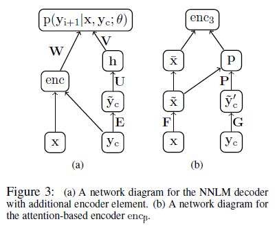  
    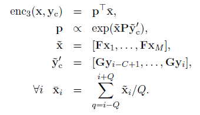
- 生成摘要使用Beam Search算法
- 本模型效果并不让人满意
- 性能(ABS)
    - DUC-2004: Rouge-1:26.55/Rouge-2:7.06/Rouge-L:22.05
    - Gigaword: Rouge-1:30.88/Rouge-2:12.65/Rouge-L:28.34

## Abstractive Sentence Summarization with Attentive Recurrent Neural Networks

- Sumit Chopra et al., Facebook AI Research
- NAACL2016
- sentence level
- encoder: 使用了基于注意力的CNN
    - 先将词的原始embedding(x_i)和位置embedding(l_i)（可训练）相加，作为词的full embedding(a_i)
    - 然后使用size=5的一维卷积核做一个卷积操作，得到aggregate embedding(z_i)
    - 计算attention：  
    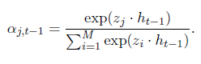  
    h_t-1是t-1时刻的隐层状态（吧）
    - 计算t时刻encoder的输出c_t:  
    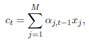
- decoder: 普通的RNN和LSTM都试了
    - 状态更新：  
    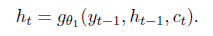
- 模型encoder的输入每次都是一个完整地句子，decoder每次要输出的时候，会将h_t-1给encoder，encoder根据句子和h_t-1计算attention生成c_t给decoder，然后decoder根据(y_t-1, h_t-1, c_t)计算要输出的单词。encoder还要更新position embedding(l_i)
- 性能(RAS-Elman, k=10, k means beam size):
    - DUC-2004: Rouge-1:28.97/Rouge-2:8.26/Rouge-L:24.06
    - Gigaword: Rouge-1:33.78/Rouge-2:15.97/Rouge-L:31.15

## Abstractive Text Summarization Using Sequence-to-Sequence RNNs and Beyond

- Ramesh Nallapati, Bowen Zhou, Cicero dos Santos; IBM
- CoNLL2016
- 这篇文章除了seq2seq，还用了很多的tricks来提升性能，model部分看起来挺多的，LVT在网上搜不到，搜sampled softmax就能搜到了。
- Models
    - LVT/sampled softmax: seq2seq输出的时候使用了softmax，计算V中的每个词的值并归一化，这一步非常耗时。sampled softmax对每个句子/文章单独采样了一个V'，只对V'中的词计算softmax并归一化，大幅减少了训练时的计算量。不过在测试的时候仍然需要计算所有词
    - Feature-rich encoder: 就是将POS、NER、TF、IDF等文本特征拼接在word embedding后面作为encoder的输入
    - Switching Generator-Pointer: 这个操作主要用于解决OOV和UNK问题，当碰到OOV时，g_i置为0，模型会从输入中寻找一个词作为输出和下一时间片的输入。测试时模型会自动决定采用decoder的输出还是从输入中挑选一个词作为输出。
    - Hierarchical Attention: 模型会对每个句子计算attention，并整合句子的权重计算每个词的权重。句子的的隐层状态后面还会拼接position embedding。
    - Hierarchical Attention效果没有预期的好，作者还使用了Temporary Attention(Sankaran et al., 2016, Temporal Attention Model for Neural Machine Translation)，效果大幅提升。
- DataSet: 本文提出了CNN/Daily Mail Corpus，每个摘要包含了多个句子（之前的DUC2004和Gigaword每个摘要只包含1个句子），后续被大量用于评测。
- 性能
    - Gigaword: Rouge-1:35.30/Rouge-2:16.64/Rouge-L:32.62
    - CNN/Daily Mail Corpus: Rouge-1:35.46/Rouge-2:13.30/Rouge-L:32.65

## Selective Encoding for Abstractive Sentence Summarization

- Qingyu Zhou, Nan Yang, Furu Wei, Ming Zhou; MSRA&HIT
- ACL2017
- sentence level again
- Models
    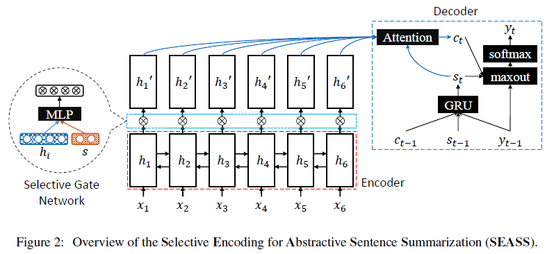
    - Encoder没什么好说的，单层BiGRU为每个词x_i生成一个2d维的hidden state(h_i)
    - Selective Mechanism是将词的h_i与句子的s拼接到一起，搁到一个前馈网络里生成输出h'_i。~~行吧，但是你这s有点不讲道理啊，凭啥s=[h←_1, h→_n]，凭啥这个就能代表整个句子。~~h←_1表示从右到左读取了整个句子, h→_n表示从左到右读取了整个句子，看起来还是比较合理的。
    - Decoder的不同在于maxout。GRU使用s_t-1, c_t-1, y_t-1更新s_t；s_t+h_i计算e_i然后归一化得到权重α_i，乘以h'_i得到context向量c_t，和s_t、y_t-1一起放到一个maxout层(k=2)中得到output，然后使用softmax。这个maxout层有点意思，相当于不同层网络之间有2套互相独立的权重参数，输出z的时候选一个能让z大的参数。这里encoder使用了BiGRU，decoder得到的输出是2d，使用k=2的maxout合并相邻的两个数值，将输出降为d维（细细一想好像不是很有道理……把第i个和d+i个合并是不是好一点，毕竟在向量空间中是同一个维度）。
- 性能: all are state-of-the-art
    - Gigaword(Rush et al., 2015): Rouge-1:36.15/Rouge-2:17.54/Rouge-L:33.63
    - Gigaword(ours):  Rouge-1:46.86/Rouge-2:24.58/Rouge-L:43.53(sounds something strange??? why so high?)
    - DUC2004: Rouge-1:29.21/Rouge-2:9.56/Rouge-L:25.51

## Incorporating copying mechanism in sequence-to-sequence learning

- Jiatao GU et al.
- ACL2016
- using LCSTS Dataset
- Models
    - 整体: 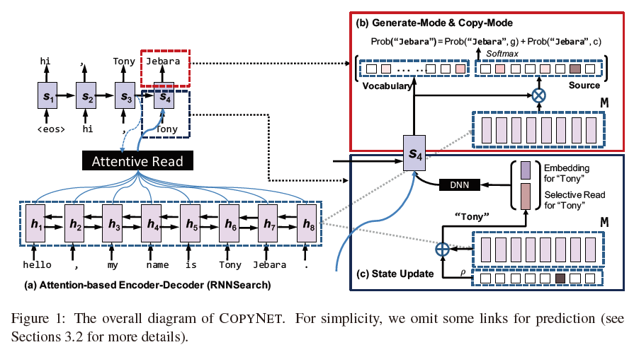
    - Decoder State Update: s_t=f(s_t-1, y_t-1, c_t)这个和常规的是一样的，但是这里的y_t-1=[e(y_t-1), C(y_t-1)]T，e就是y_t-1的embedding，C是输入单词的权重，对跟y_t-1相同的词进行计算，不相同的词直接置0，然后归一化。
    - Prediction: 相比上一个有个开关的方式，这篇论文则将概率相加再softmax得到输出。对于V中的每个词，计算generation模式的概率，对于X中的每个词，计算copy模式的概率，最后进行归一化，得到输出。  
    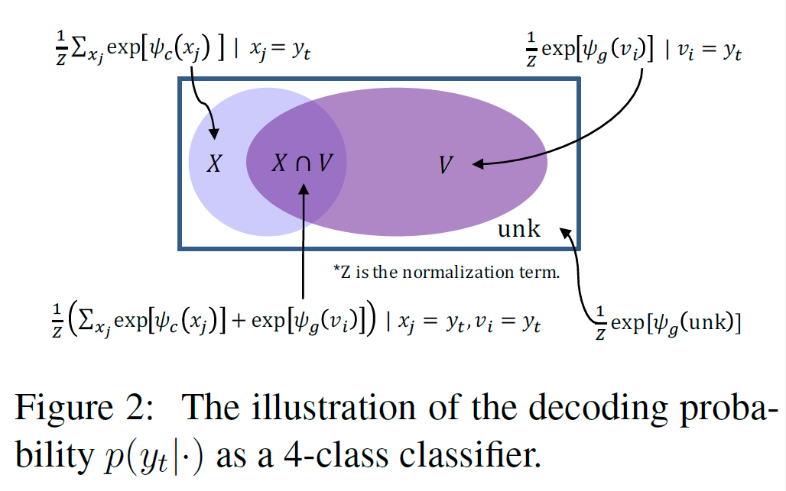
- Code: https://github.com/MultiPath/CopyNet
- 性能:
    - LCSTS(Word Level): Rouge-1:35.0/Rouge-2:22.3/Rouge-L:32.0

## Sequential Copying Networks

- Qingyu Zhouy, Nan Yang, Furu Wei, Ming Zhou; HIT & MSRA
- AAAI2018
- 原先的CopyNet每次copy一个词，这篇文章一次可以copy多个词（词组），通过给每个copy的词打标签来判断是否结束
- 性能
    - Gigaword: Rouge-1:35.93/Rouge-2:17.51/Rouge-L:33.35

## Global Encoding for Abstractive Summarization

- Junyang Lin, Xu Sun, Shuming Ma, Qi Su; PKU
- ACL2018
- Models
    - 这篇文章想解决的问题是decoder在输出时可能会不断重复已有的单词。在ICLR2018的```A Deep Reinforced Model for Abstractive Summarization```已经用过Intra-Decoder Attention尝试从已经输出过的内容上解决这个问题，这篇文章提出了Global Encoding方法使用源文本来尝试解决这个问题。
    - 模型的encoder和decoder都比较常规，BiLSTM作为encoder，LSTM作为decoder。但是对于encoder的输出h_i，模型使用了CNN门控单元和self-attention机制来计算全局的权重，最终作为decoder的输入。

## A Deep Reinforced Model for Abstractive Summarization

- Romain Paulus, Caiming Xiong & Richard Socher; Salesforce Research
- ICLR2018
- Renforcement Learning
- Models(Attention Mechanism)
    - Intra-Temporal Attention: 普通的Attention都是依次计算当前decoder的状态s_t与每个encoder的隐层状态h_i的得分e_i，然后归一化得到权重α_i，再加权求和得到上下文向量c_t。这篇文章对e_i做了修改，对所有时间片t的e_ti做归一化，得到对应时间片的归一化时序得分e'_ti，然后再对所有encoder的隐层状态做一次归一化得到权重并计算c_t。  
    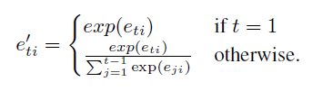  
    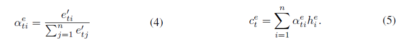
    - Intra-Decoder Attention: 普通的Attention都是计算当前decoder状态与不同encoder之间的权重。然而，已经由decoder输出的词对decoder输出下一个词同样是有影响的，例如可以避免输出陷入循环。因此这篇文章设计了一个decoder当前隐层状态与decoder历史隐层状态的attention机制。先计算当前h_t与历史每个h_t'的得分，然后归一化得到权重，最后加权求和得到decoder的上下文输出c_t_d。  
    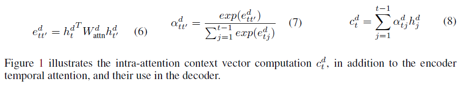
    - Generation/Pointer: 这里的copy机制与CopyNet有稍许不同。CopyNet是计算Generation、Pointer模式下的得分，最后统一归一化得到概率。这里先计算使用Pointer模式的概率，然后求得y_t的期望，选择期望最大的值作为输出。模式概率计算如公式:  
    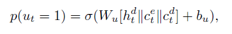  
    Pointer模式下y_t=x_i的条件概率直接取Intra-Temporal Attention中计算出的权重α_i，Generation模式下的条件概率使用softmax得到，计算公式类似于上述公式（σ替换为softmax）
    - Weight Sharing: 输出的embedding matrix是由输入的embedding matrix之间加了一层非线性映射得到的。（参考Inan et al. (2017) and Press & Wolf (2016)）
    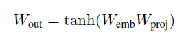
    - beam search的时候，对于已经出现过的trigram，直接将概率设为0避免重复。
- Models(Hybrid Learning Objective)
    - Teacher Forcing算法。通常的目标函数都是NLL，然而即便达到最优，在使用离散评价方式（ROUGE, CIDEr, BLEU）进行评价的时候，往往得不到最好的效果，主要原因有俩：1. 训练的时候使用正确的单词作为下一时间片的输入，每一步的错误不会累积，但是测试的时候每一步的错误会累积到下一时间片。2. 输出文本的词序是灵活的，离散的评价方式也考虑到了这种灵活性，但是NLL没有。
    - Policy Learning: 强化学习的两种常用算法（Policy Gradient, Q-Learning）之一。本文使用self-critical policy gradient training algorithm (Rennie et al., 2016)。decoder生成2个输出序列，一个使用常规的方法生成y^，另一个基于p(ys_t|ys_t-1, ..., ys_1, x)概率分布抽样得到ys，r是评分函数，强化学习的目标函数如下：  
    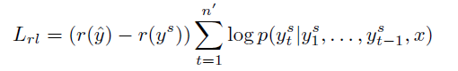  
    最终的混合目标函数如下：  
    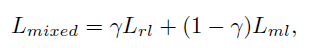
- 性能
    - CNN/Daily Mail(only ML): Rouge-1:38.30/Rouge-2:14.81/Rouge-L:35.49
    - CNN/Daily Mail(only RL): Rouge-1:**41.16**/Rouge-2:15.75/Rouge-L:**39.08**
    - CNN/Daily Mail(ML+RL): Rouge-1:39.87/Rouge-2:**15.82**/Rouge-L:36.90
- 分析
    - 我们可以看到only RL的Rouge评分高于ML+RL不少，然而其可读性得不到保证。我们对每条摘要找了5个人从1-10分中打分，RL的得分是最低的，远低于ML。ML+RL的得分则最高。  
    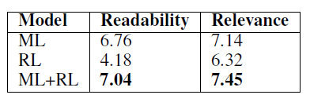

## Fast Abstractive Summarization with Reinforce-Selected Sentence Rewriting

- Yen-Chun Chen, Mohit Bansal; UNC Chapel Hill
- ACL2018
- Extractor + Abstractor + Reinforcement Learning
- 与我们的需求并不完全符合，没有深究
- Models  
    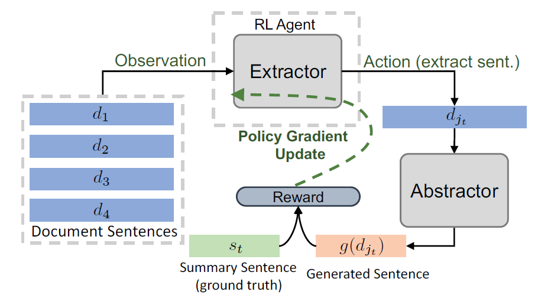
    - **快**: parallel decoding
    - decoder: CopyNet-like
    - 强化学习仅调整Extractor参数，不调整Abstractor参数，避免生成的句子可读性差，同样使用Policy Gradient学习算法。
- 性能
    - CNN/Daily Mail: Rouge-1:40.88/Rouge-2:17.80/Rouge-L:38.54

## A Reinforced Topic-Aware Convolutional Sequence-to-Sequence Model for Abstractive Text Summarization

- Li Wang1, Junlin Yao2, Yunzhe Tao3, Li Zhong1, Wei Liu4, Qiang Du3
    - 1 Tencent Data Center of SNG
    - 2 ETH Zurich
    - 3 Columbia University
    - 4 Tencent AI Lab
- IJCAI-ECAI2018
- Conv Seq2seq + LDA + Reinforcement Learning
- Models
    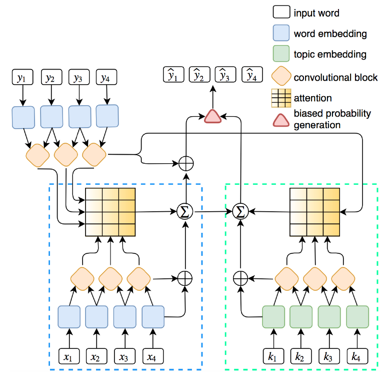
    - Position Embedding: 每个词的输入=词向量+位置向量。词向量是随机初始化的，位置向量没说。
    - Gated Linear Unit: 每层的卷积操作做个线性变化到2d维，拆分成[A; B]，然后两边残差连接喂入下一层
    - Multi-Step Attention: 先对隐层状态做个embedding再计算权重:  
    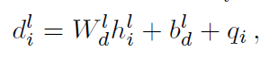  
    W、b是参数，h是隐层状态，q_i是上一个输出的词。
    - Topic Embedding: 对于每个主题，抽取出前N个词出来构成词表K，预训练得到topic embedding。对于输入中的每个词，如果在K中，则使用topic embedding，否则使用word embedding。
    - Joint Attention: 在Topic-aware Conv过程中，计算Attention权重时，除了要计算当前decoder隐层状态与每个encoder输出的点积，还要计算当前decoder隐层状态与input ebmedding中每个encoder输出的点积，再求和并归一化作为权重。
    - Biased Probability Generation:  
    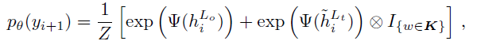  
    Ψ是一个带偏置项的线性变换。
    - Reinforcement Learning: 策略和```A Deep Reinforced Model for Abstractive Summarization```一模一样，λ_RL=0.99
- 性能
    - Gigawords: Rouge-1:36.92/Rouge-2:18.29/Rouge-L:34.58
    - DUC2004: Rouge-1:31.15/Rouge-2:10.85/Rouge-L:27.68
    - LCSTS(word): Rouge-1:39.93/Rouge-2:33.08/Rouge-L:42.68

## Controllable Abstractive Summarization

- Angela Fan, David Grangier, Michael Auli, Facebook
- ACL2018
- 之前的论文都忽视了用户的个人风格，包括摘要长度，行文风格，用词等。这篇论文可以按照用户的输入来生成类似风格的摘要。在无用户输入的情况下，模型也能达到State-of-the-art。

## Deep Communicating Agents for Abstractive Summarization

- Asli Celikyilmaz1, et al.; MSRA
- NAACL2018
- Models
    - 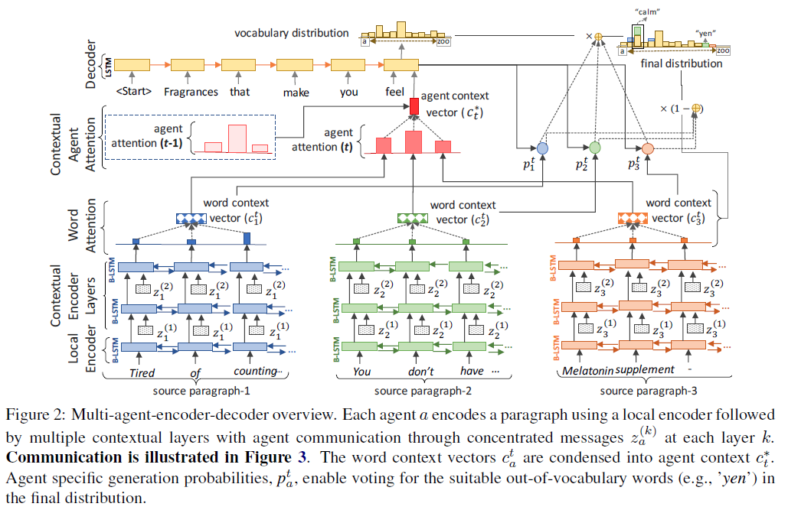
    - 这篇文章想解决长文本的摘要问题，将文本划分成多个段落，对每个段落进行encode操作并计算内部的word attention，最后得到整个段落的embedding。之后将所有段落合并到一起计算Context Agent Attention，作为decoder的输入。
    - 改进了Pointer Network，可以从不同段落中抽取单词。
    - 同样使用了Reinforcement Learning，但是前面的RL目标函数都是采样得到一个y*，再计算y*与输出的y^之间Rouge得分差作为优化目标。这篇文章的每输出一个单词就计算一次当前Rouge得分，减去上一次的得分，作为优化目标。

## Generative Adversarial Network for Abstractive Text Summarization

- Linqing Liu et al.; 中科院深圳先进技术研究院
- AAAI2018
- Models

## Examples

### A Reinforced Topic-Aware Convolutional Sequence-to-Sequence Model for Abstractive Text Summarization

- Source: 昨日，商报记者从代表国内婚尚产业“ 风向标” 的上海国际婚纱摄影器材展览会上了解到，部分商家开始将婚庆布置、婚礼流程、形式交给新人决定以迎合## 后新人的需求。此次展览会的规模超过#万平方米，吸引参展企业超过###家。
- Reference: 婚庆“私人定制”受##后新人追捧
- Output:上海国际婚纱摄影器材展览会昨举行
<br/><br/>

- Source: 新疆独特的区位优势，使其成为“ 一带一路” 战略重要一环。记者从新疆发改委获悉，库尔勒至格尔木铁路先期开工段已进入招投标阶段，计划#### 年##月中旬正式开工建设。#### 年计划完成投资## 亿元。
- Reference: “一带一路”战略惠及新疆<unk>, 铁路年底开建
- Output: 库尔勒至格尔木铁路拟##月开工建设
<br/><br/>

- Source: 成都市软件和信息技术服务业近年来一直保持快速增长势头，稳居中西部城市之首，已成为我国西部“ 硅谷” 。《#### 年度成都市软件和信息技术服务产业发展报告》日前发布......详情请见: @ 成都日报@ 成都发布
- Reference: 成都倾力打造西部“ 硅谷”
- Output: 成都软件和信息技术服务业跃居西部“ 硅谷”
  <br/><br/>

- Source: 根据#### 年# 月# 日国家发改委等部门联合发布的《关于进一步做好新能源汽车推广应用工作的通知》，#### 年的补贴金额相比####年将降低##%。（分享自@ 电动邦）
- Reference: 补贴金额再缩水####年新能源车政策解读
- Output: 国家发改委发文进一步做好新能源汽车推广应用工作

### Global Encoding for Abstractive Summarization

- Source: 较早进入中国市场的星巴克， 是不少小资钟情的品牌。相比在美国的平民形象，星巴克在中国就显得“高端”得多。用料并无差别的杯中杯美式咖啡，在美国仅约合人民币12元，国内要卖21元，相当于贵了75%。第一财经日报
- Reference: 媒体称星巴克美式咖啡售价中国比美国贵75%。
- Output: 星巴克美式咖啡中国贵75%。

## 后续方向

- 商讨项目前端的样式
- 选取一些模型进行实验