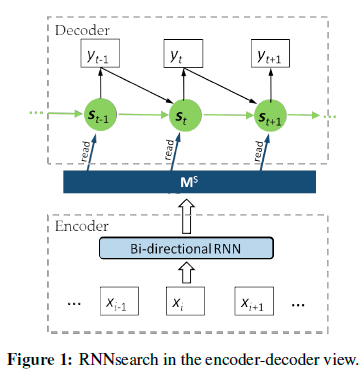
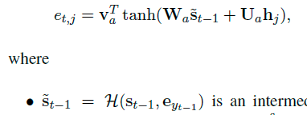
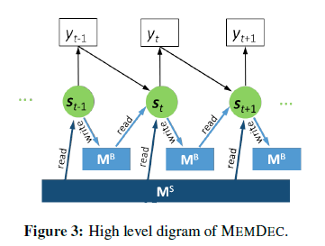
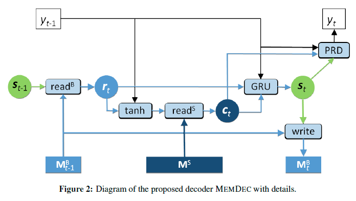
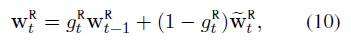

# EMNLP2016_Memory-enhanced Decoder for Neural Machine Translation

- Mingxuan Wang, Zhengdong Lu, Hang Li, Qun Liu
- 计算所智能信息处理实验室，华为诺亚实验室
- 大意：借鉴了NTM的思想，为S2S中Decoder部分的RNN结构增加了可读写的外部记忆，提升RNN理解信息的能力，以提升机器翻译的性能。BLEU提升了4.8个点。
- Model：
    - 本模型的基础是Attention-based Seq2Seq模型：  
      
    作者提了一个改进Attention方法，对s_t-1和y_t-1进行一次非线性变换（tanh或者GRU）+线性变换，对encoder的每个h_j进行一次线性变化，然后两者相加进行一次tanh+线性变换，得到得分e_t,j。核心思路是将当前状态和上一个预测的词结合起来，然后计算和原文词之间的权重  
    
    - 作者提出了一个增强记忆的Decoder模块MEMDEC，下图是从框架层面看MEMDEC的结构，可以看到明显多了一个外部记忆MB，同时定义了Read和Write两个函数，用来对MB进行读写操作    
    
    - MEMDEC的具体计算过程如图。整个Decoder的计算可以分为3个部分，一是隐层状态s_t的更新，二是外部记忆MB_t的更新，三是预测当前时间片的输出词。具体计算流程已经非常清楚了，最多有些线性变换没有写在上面，问题只在于read和write函数如何设计了。  
    
    - read_B：read_B是所有记忆的加权求和，权重的计算不仅依赖于当前记忆，还依赖于上一时间片的权重。从公式上看主要有g_R_t和w~_R_t需要明确
        - g=σ(w*s_t), w∈Rm
        - w~是上一时刻的MB_t-1和s_t-1做各种线性变换得到的得分再softmax得到的权重。  
    
    - Write_B：写B这块分成了增加Add和擦除Erase两部分。
        - Erase：每条记忆MB_t(i) = MB_t−1(i)(1 − w_W_t(i)*μ_ERS_t)。先计算得到一个擦除向量μ_ERS_t，然后对每条记忆乘以一个带权重的擦除向量。该权重同read_B的权重w_R_t。
        - Add：计算一个增加向量μ_ADD_t，然后用擦除后的记忆加上带权重的增加向量。
