# Recent Trends in Deep Learning Based Natural Language Processing 笔记
最近打算看一些nlp的综述，前面看了一个，但是笔记没做下去。
这篇是将深度学习在nlp中的发展和趋势
**2018.2 by sunshinebot**

# 分布式表示方法

语言模型常常受到维数灾难的困扰，所以人们在研究语言在低维空间中的表示方法。

## 词嵌入

分布式向量或者词嵌入基于这么个假设：意思相近的词通常有着相似的上下文。因此，一个词的向量通常反映着相邻词的特征。词向量的一个牛逼的好处是可以捕捉词之间的相似性，而词向量距离的计算又很方便。词嵌入一般是深度学习模型的第一步。在无标签的大语料上精心优化过的预训练词向量因为包含了通用的语法和语义信息，在捕捉上下文相似性上取得了很好的效果。

词嵌入一直用的浅层的神经网络，不过深度学习也一直用这些浅层网络训练的词向量（以及词组、句子的嵌入），效果贼好。
举几个栗子：
- stacked denoising autoencoders（SdA）层叠（降噪）自动编码机[Domain adaptation for large-scale sentiment classification: A deep learning approach]
- combinatory categorial autoencoders[The role of syntax in vector space models of compositional semantics]

分布式表示一般来说都是通过上下文学习的。上世纪90年代一伙人在研究分布式的语义表示，后来对这些研究的扩展形成了LDA和语言模型，这些工作是表示学习的基础。

2003年Bengio提出了个神经网络语言模型，如果将词序列的联合概率表示成句子，那这个模型可以表示句子之间的语义相似度。

2008年Collobert and Weston最开始使用预训练词向量，他们的工作是的训练词向量成为nlp任务中的一个好用的工具。不过按理说直到2013年Mikolov提出了连续词袋模型和skip-gram模型来高效的建立分布式词表示，词嵌入才广泛流行。2014年Pennington又提出了另一个著名的词嵌入方法，他将词出现的次数进行归一化和对数平滑，形成词共现矩阵，然后通过减小重建损失进行矩阵分解得到低维表示。

## word2vec

Mikolov在2013年提出的词袋模型和skip-gram模型给词嵌入带来了革命性的改变。CBOW词袋模型在给定上下文单词的条件下计算目标单词的条件概率，skip-gram则在给定目标单词的条件下计算上下文单词的条件概率。上下文单词指的是目标单词两边出现的相同数量的单词。

简化版的CBOW模型(上下文单词只有一个）如图所示：  
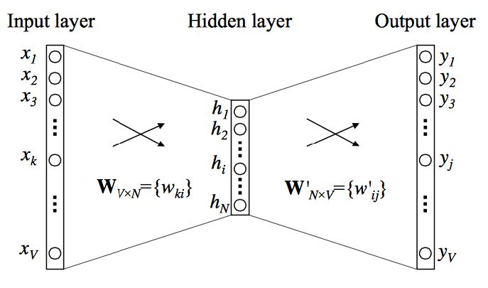
CBOW是一个单隐层的全连接网络，输入层是上下文单词的one-hot向量，隐层有N个神经元，输出层是所有单词的softmax。每个单词最终会用两个向量vc和vw表示，分别表示上下文（context）和目标单词（target word）。
对于单词wi和上下文c，在该上下文下单词出现的概率如式2：  
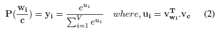  
参数就是θ=(vw和vc)，目标函数是对数似然函数，如式2和3  
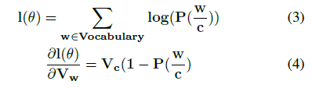  
在通常的CBOW模型中，上下文向量就是将多个上下文单词的向量相加作为输入。

我们是对每个独立的词进行嵌入的，它的局限是无法表示词组。词组中的各个单词的词向量相加并不能表示词组的意思。一个解决方案（Mikolov, 2013a）是词共现的思路，将词组作为一个单词单独训练。近期的方法还有从无标签数据中直接学习n-gram嵌入（Johnson andZhang, 2015）

我们的上下文单词在目标单词的较小的窗口内，这导致一些单词（例如good和bad）有相同的词向量，如果用来进行语义分析会有问题。再往上进行情感分析就甭谈了。（Tang, 2014）提出了情感特定词嵌入（sentiment specific word embedding(SSWE)），把训练词向量合并到有监督的情感极性分析的目标函数中去。

词向量的一个疑虑是它们和应用往往高度独立，（Labutov and Lipson, 2013）提出特定任务的词嵌入，在特定任务中再次训练词向量以使得词向量与任务空间对齐，因为从头训练词向量非常耗费时间和资源。（Mikolov, 2013b）提出了负采样（negative sampling）试图解决这个问题，负采样仅仅是在训练模型是基于频率来采集负样本。

## 字符嵌入

词嵌入可以捕捉句法和语义信息，但是对词性标注或者NER任务，词的内部结构和外形信息也很有用。在字符层面建立自然语言理解系统最近也比较流行。(Santos and Guimaraes, 2015)把字符层面的表示和词嵌入一起用在NER任务中，在葡萄牙与和西班牙语语料上取得了业界领先的结果。(Kim et al., 2016)只用了字符嵌入来建立神经网络语言模型，效果也挺好。(Ma et al., 2016) exploited several embeddings, including character tri-grams, to incorporate prototypical and hierarchical information for learning pre-trained label embeddings in the context of NER（这句好难翻译，凑合着看吧）

字符嵌入可以自然的用在处理未知单词上。而像中文这种语言，文本是由单个的字而不是分开的词组成的，词的语义信息又由字（符）组成，就特别适合在字符水平上进行处理，可以避免分词(Chen et al., 2015a)。因此这类语言更趋向于使用字符嵌入。（Peng, 2017）证明部首的处理可以大幅提高情感分类性能，特别指出，他们提出了两种中文的基于部首的分层潜入，在字符层面同时合并了语义和部首信息。

# 卷积神经网络CNN

表示词信息的词嵌入越来越流行，人们开始尝试在更高层次上从词或者词组中提取特征。这些抽象特征用来做情感分析、摘要、机器翻译、QA等任务。CNN经常用在CV上，因为效果很好。

Collobert and Weston从2008年开始使用CNN来为句子建模，这项工作用在了很多任务上。他们做了个表，每个词对应一个向量（维度由用户定义），一个由单词{s1, s2, ..., sn}构成的句子被转换成一串向量{ws1, ws2, ..., wsn}。
这是在训练过程中确定词嵌入权重最早的做法，Collobert在2011年扩展了之前的方法，提出了一个通用的基于CNN的框架来解决一大波NLP问题，让CNN在NLP领域火了起来。

CNN有能力从输入句子中提取显着的n元语法特征，为下游任务创建一个信息潜在语义表达的句子，早期工作主要有(Collobert et al., 2011; Kalchbrenner et al., 2014; Kim, 2014)，后续带起了一波基于CNN的网络模型。

## 基本的CNN网络

### 句子建模

句子中的第i个单词用向量wi表示，一个n个单词的句子可以表示成一个n×d维的矩阵W，如图所示：  
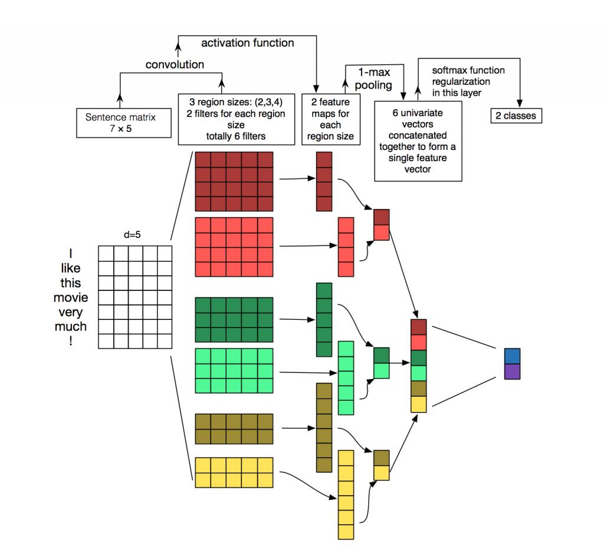  
w(i:j)表示将wi,wi+1,...,wj拼接在一起，一个hd维的滤波器（卷积核？）可以从长度为h的窗口中产生一个新特征，例如，特征ci可以从w(i:i+h-1)中产生：  
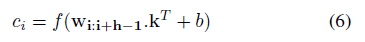  
其中b是实数，f是非线性激活函数，滤波器从全部窗口中创建特征图，参数相同。

CNN中会有大量宽度不同的卷积滤波器（也被称为核）依次滑过整个词嵌入矩阵，每个核提取出一个n元组特定的模式，卷积层后面常常跟着一个最大化池化层，从每个核中选最大值以达到下采样的目的。这有俩主要的原因：一个是池化层可以无视卷积核大小将输入变为维数固定的输出，便于进行分类；二是在保留句子n元组最突出特征的情况下降低了输出的维数。这是以平移不变的方式完成的（emmm？），其中每个卷积核可以从句子的任何地方提取特定的特征，然后加到最终的句子表示中。

词嵌入可以随机初始化或者预训练，在有标签数据有限的情况下，这样做对提升性能有好处（Kim, 2014）。卷积层和最大化池化层结合起来常常用于构建深度卷积网络。连续的卷积网络有利于挖掘句子中的信息，并将丰富的语义信息表示出来。深层卷积核可以获取句子的全局特征。

### 窗口方法window approach 

前面的句子表示都是基于完整句子的，不过想NER、POS tagging、SRL这些任务，是基于词来进行预测的。因此人们搞出了个窗口，对每个目标词，划定一个固定大小的窗口，窗口内的词构成一个子句（sub-sentence），每个子句独立使用CNN来提取特征。目标词位于窗口中心。

（Poria, 2016）用这个方法搞了一个多层级deep CNN来给句子中的每个词可能的方面打标签，加上一套其它的语言模式，他们的集成分类器在aspect detection上效果很好。

词水平的分类的主要目标是对整个句子给出一个标签序列。CRF(条件随机场)等结构化预测方法优势可以更好地捕捉相邻标签间的依赖关系，最终生成连续的标签序列，得到整个句子的最高分数（Kirillov, 2015）

为了考虑更大范围的上下文信息，经典的窗口方法和时延神经网络（TDNN）可以组合使用。卷积层因为卷积核的宽度受到约束，经典的窗口方法只考虑到窗口内目标词周围的词，TDNN可以同时考虑到句子中词的所有窗口。有时候TDNN层也想CNN一样堆叠起来，在低层提取局部信息，高层提取全局信息（Collobert, 2011）

## 应用 

（Kim, 2014）用上述架构进行了很多句子分类任务，包括情感分类、主题分类、问题类型分类，都取得了很好的效果。训练完特定的任务后，随机初始化的卷积核成为特定的n元特征检测器，对于该目标任务是有用的（*这句话没懂*）。不过这个简单的网络有很多缺点，最主要的是CNN难以获取长距离的依赖信息。

(Kalchbrenner et al., 2014)有效的解决了这个问题，他提出了动态卷积网络来给句子进行语义上的建模。他们的主要工作是提出了动态k-max池化策略，在给定序列p的情况下，可以选择k个最活跃的特征，保留顺序信息并且对具体位置不敏感。在TDNN概念的基础上，他们用k-max池化策略建了个模，可以用小宽度的卷积核来捕捉句子内部长跨度的关键信息。他们把这个东西用在了情感预测、问题类型分类上，效果贼好。他们在单个内核的范围，同时试图模拟上下文语义，并提出了扩展其范围的方法。

涉及到情感分析的任务也需要有效提取aspects（？？难道是观点？不太合理啊）（Mukherjee and Liu, 2012）。（Ruder, 2016）用CNN取得了很好的效果，他们将aspect向量和词嵌入拼接到一起作为输入。CNN建模在不同长度的文本中表现并不一样，（Johnson and Zhang, 2015）指出CNN在长文本中的性能好于短文本。（Wang, 2015b）提出使用CNN来为短文本建模，但是非常缺少上下文信息，因此花了很多精力提出有意义的表示，作者提出了一个语义聚类方法，它将多尺度的语义单元作为短文本的外部信息。CNN用来将这些单元结合起来并形成整个表示(overall representations)。实际上，基于CNN的模型总是需要大量上下文信息，使用CNN来进行短文本上的任务往往需要额外的信息和外部知识。（Poria, 2016）在使用CNN在推特文本上进行讽刺检测也发现了这一点。Auxiliary support, in the form of pre-trained networks trained on emotion, sentiment and personality datasets was used to achieve state-of-the-art performance.（这句话没懂，找不到主语）

CNN还有别的用处。(Denil, 2014)用DCNN来映射词义以生成摘要。他们的亮点是提出了新的可视化技术，不仅可以将学习过程可视化，还可以将文本的自动摘要可视化。

在QA领域，(Yih, 2014)提出了一个测量问题和KB中的条目的语义相似度的方法，用来决定使用KB中的哪些知识回答问题。和分类问题不一样，监督信号来自正面或者负面的文本对（例如查询文档），而不是类别标签。(Dong, 2015)提出了多栏CNN(MCCNN)来从多个方面分析和理解问题。MCCNN使用多个栏目（column）的网络从回答类别和输入问题的上下文提取信息。通过使用迪维向量表示KB中的实体和关系，他们用问题-答案对类训练CNN模型，并对候选答案进行排序。(Severyn and Moschitti, 2016)用CNN来建模并表示问题和答案句子，他们在嵌入中提出了一个附加特征，即通过问题-答案对中的匹配词给出的关系信息。这些参数可以通过网络调整，这个简单的忘了咯可以得到堪比state-of-the-art的结果。

CNN还可以用来做一些超越分类的予以匹配的NLP任务(Hu, 2014)。(Shen, 2014)提出了一个和上面的CNN相似的模型来做信息恢复。这个CNN用来将查询和文档映射到一个固定维度的语义空间中，其中查询和文档之间的余弦相似度会用来对特定查询的文档进行排序。这个模型试图通过查询或者文档中的词序列中的时间上下文窗口来提取上下文结构信息。

CNN以有线的方式（？）捕捉句子中最重要的信息。传统的最大化池化策略以评议不变的方式来实现，但是往往遗失了句子中以多个事实呈现的有价值的信息。

为了克服多事件建模的信息损失，(Chen, 2015)提出了改进的池化策略：动态多池化CNN(Dynamic mulit-pooling CNN, DMCNN)，他使用了新的动态多池化层，其中包含了事件的触发词和参数，来从池化层保留关键信息。

CNN本质上提供了某些必需的特征，例如局部连接性，权值共享，池化。这是很多任务中都需要的某种程度上的不变性。语音识别也需要这种不变性，(Abdel-Hamid, 2014)使用了CNN-HMM混合模型来提供这种不变性向频率的转移。因为说话者的差异，这种变化在语音信号中很常见，他们还限制了权值共享，减少了池化参数。(Palaz, 2015)更直接，他们把原始音频作为CNN的输入，来对原始音频和电话之间的关系进行建模，搞出了自动语音识别系统。

机器翻译之类的任务需要保留序列信息和长跨度依赖信息，和CNN相性不好。不过，还是有头铁的人，(Tu, 2015)通过同时考虑翻译对的语义相似度和他们各自的上下文来搞机器翻译问题。这个方法没有解决序列问题，不过效果还是挺不错的。  
号外：facebook开始用cnn搞机器翻译了（fairseq），2017

总的来说，CNN在挖掘上下文窗口中的语义信息上贼好使，不过CNN极度依赖数据，大量的参数需要大量的训练数据。另一个问题是没法获取长距离的上下文信息，也保留不了顺序信息，(Kalchbrenner, 2014)和(Tu, 2015)分别在句子建模和机器翻译两个任务上也只是部分解决了这个问题。在这些任务上还是要靠循环模型。

# 递归(recurrent)神经网络RNN 

(Elman, 1990)提出RNN用来处理序列信息。跟传统的神经网络不一样，RNN假设所有输入都是互相独立的。循环意味着对每个序列都执行相同的任务，输出依赖于之前的计算和结果。一般来说是将序列中的每个元素一个个输入到循环单元中，得到一个向量来表示这个序列。RNN可以记住之前的信息并应用到当前处理过程中。这个法子贼适合一些NLP任务：语言建模(Mikolov et al.,
2010, 2011; Sutskever et al., 2011)，机器翻译(Liu et al., 2014; Auli et al., 2013; Sutskever et al., 2014)，语音识别(Robinson et al., 1996; Graves et al., 2013; Graves and Jaitly, 2014; Sak et al., 2014),，图像标注(Karpathy and Fei-Fei, 2015)

## 对RNN的需求 

讲一下RNN为什么能够这么火。RNN可以通过对序列中的单元进行建模而处理有序信息，因此，将字、词甚至句子视为一个序列单元，RNN可以捕捉语言中固有的连续性。语言中的词的语义常常依赖于前一个词，RNN天然适合对这种东西建模。

RNN火起来的另一个原因就是方便处理不同长度的文本，比如长句子、段落、一篇文档(Tang et al., 2015)。相比CNN，RNN很适合处理没有固定长度限制的文本。

很多NLP任务要对整个句子进行语义建模，RNN很擅长这个，因此在机器翻译中用的越来越多，因为机器翻译任务需要将句子搞成一个固定长度的向量然后重新映射秤一个变长的目标序列。RNN还能联合时间分布进行处理，大多数序列标签任务（例如词性标注(Santos and Zadrozny, 2014）都在这个范畴里。RNN还用在文档分类(Chaturvedi et al., 2016)，多标签文本分类(Chen et al., 2017)，多模态情感分析(Poria et al., 2017; Zadeh et al., 2017; Tong et al., 2017)，主题检测等任务上(Chaturvedi et al., 2017)

上面几点是选择RNN的主要原因。不过RNN并不能完全代替其它深度网络。即便是在适合RNN的任务上，例如语言建模(Dauphin et al., 2016)，最近也有CNN表现跟RNN差不多甚至更好的。CNN和RNN的目标不一样。RNN试图从无限制的上下文中搞出一个任意长度的句子（序列），CNN则试图提取出最重要的n元组。不过CNN虽然剋以有效的提取n元组特征，在一些特定任务中很好使，但是在局部范围内捕捉词序信息，长跨度的依赖信息基本被忽略。

(Yin et al., 2017)这个人很有意思，他搞了个测试，在多个nlp任务中比较RNN和CNN的性能，结果打个不相上下。网络的性能还是取决于任务自身需要的全局语义信息。

## RNN模型 

### 简单RNN模型 

NLP中用的RNN主要是基于Elman在1990年提出的三层网络。下图展示了一个按时间展开的常见的RNN，它可以i容纳整个序列的信息。xt是步骤t时的输入，st表示步骤t时刻隐层状态，st的计算公式：  
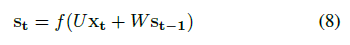  
st由上一个时刻的状态和这一时刻的输入决定，f是个非线性激活函数（Relu，tanh），U、V、W时跨时间（步骤）的权重。在NLP中，x通常是one-hot编码或者嵌入，有时候也可以是文本的抽象表达。ot是网络的输出。  
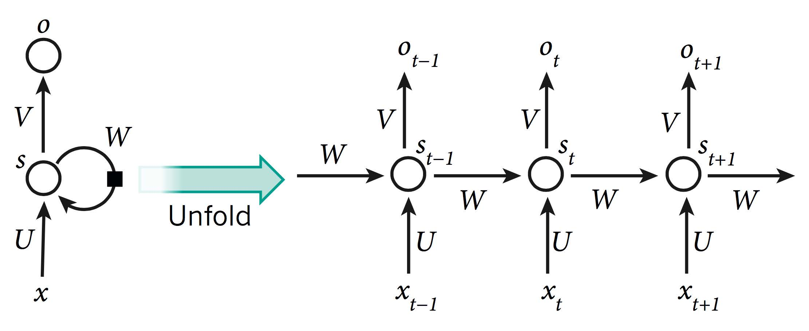  

动动脑子就能知道RNN中最重要的就是隐层状态，它可以记住其他时间积累的信息。实际使用中简单的RNN遇到了麻烦的提督小时问题，导致RNN很难调参和训练。不过这个问题被后来提出的LSTM(long short-term memory)和GRUs(gated recurrent units)和ResNets(residual networks)克服了。

### LSTM

(Hochreiter and Schmidhuber, 1997; Gers et al., 1999)提出的LSTM在简单RNN上增加了一个遗忘门，这个机制可以解决梯度消失和梯度爆炸问题。跟香草（黑人问号？？？）RNN不一样的是，LSTM允许错误无限次反向传播，LSTM有输入、遗忘、输出三个门，隐层状态计算公式如下：  
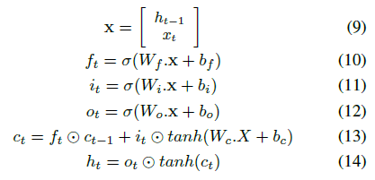  

### GRU

(Cho et al., 2014)提出了GRU，复杂度低一些，在多数任务中和LSTM性能差不多。GRU有重置和更新两个门，像一个没有记忆单元的LSTM一样处理信息流，因此将全部隐藏内容暴露出来（？），GRU的计算公式长这样：  
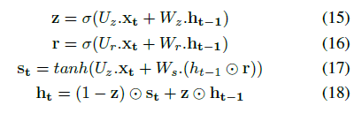  

选什么模型常常是启发式的，(Chung et al., 2014)在和弦音乐建模和语音信号建模上做了实验，RNN效果明显比较菜，LSTM和GRU则不好说，一般来说要根据其他因素来选择。

*前面记得比较细，太费劲了，后面简略记一下*

## RNN应用

### 词水平分类

(Lample et al., 2016)提出了双向LSRM来做NER任务，可以捕捉到任意长度的上下文信息，顶层建立了一个全连接层，最后一层使用了CRF层。

(Graves, 2013)提出用RNN来给长跨度上下文结构的句子建模，还使用了深度RNN来增强模型。后来(Sundermeyer et al., 2015)比较了使用RNN代替前馈网络在预测单词任务上的效果，他们提出了个典型的层次结果，效果非常好，传统语言模型被RNN和后来的LSTM取代了。他们的工作在很多任务上也很适用，像是机器翻译(Sundermeyer et al., 2014)。

(Kim et al., 2016) and (Lample et al., 2016)在搞字符水平的表示学习，他们的模型包含了语义和拼写信息，可以打败基于词的LSTM模型的baseline。对于一些形态意义丰富的文本（俄语，中文），字符水平的表示学习效果比较好，输入占用的空间也少。不过很多领域还是要用词水平的表示学习来做。

### 句水平分类

(Wang et al., 2015a)提出用LSTM将整个微博进行编码然后预测情感极性，效果堪比DCNN(Kalchbrenner et al., 2014)，在否定词组的这个特例中，作者还表示，LSTM门可以捕捉“不”这个词的否定意义。

RNN跟CNN一样可以做语义匹配。在对话任务中，(Lowe et al., 2015)提出用双LSTM(Dual-LSTM)来匹配候选回答的信息。

### 语言生成

RNN可以用来生成自然语言，给定文本或者视觉数据，深层LSTM模型可以对机器翻译、图片标注等特定任务生成合理的文本，RNN一般作为解码器出现。(Sutskever et al., 2014)提出了一个将序列映射到另一个序列的通用的深度LSTM编码器-解码器框架，一个LSTM（encoder）用来对源序列进行编码得到一个固定大小的向量，该向量作为另一个LSTM（decoder）的初始状态，解码器逐个生成tokens，每生成一个token就用它来更新状态。集束搜索（Beam Search）常常用来估算最优序列。
(Sutskever et al., 2014)用4层的LSTM用端到端的方式做机器翻译，效果还不错。(Vinyals and Le, 2015)用相同的模型来对对话（消息-回答构成的序列到序列的映射）进行建模，训练数据超过1亿的情况下解码器可以在开放领域生成很有意思的回答。限制LSTM解码器的条件可以达到一些特定的效果，(Li et al., 2016a)提出在一个不变的人物上训练解码器，以此捕捉说话者的个人信息。  
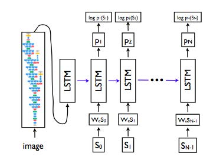  
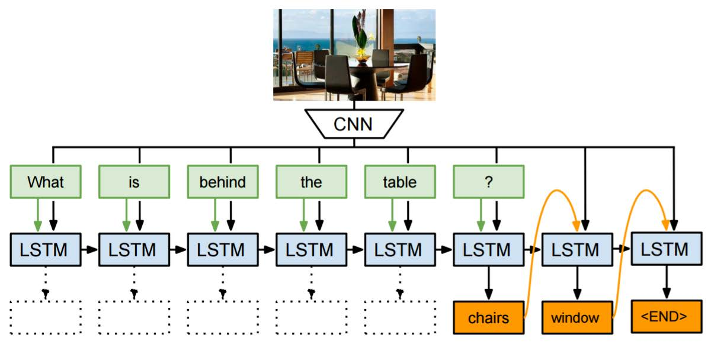

前面的例子语言都是通过表示文本的语义向量来生成，相似的框架也用来基于图片生成语言。可视化QA需要同时使用语言和视觉信息生成语言。(Malinowski et al.,
2015)最早提出方法解决这个问题，他用CNN对图像建模，用LSTM对文本建模。(Kumar et al., 2015)提出动态记忆网络（DMN）解决了这个问题，这个法子反复注意输入的文本和图像，在不断迭代中形成信息，注意力网络用来对输入的文本短语进行精细集中（？）

## 注意力机制

# 循环神经网络

# 深度强化学习模型和深度无监督学习
## 序列生成的强化学习
## 无监督句子表示学习
## 深度生成模型

# 记忆强化网络

# 总结
## 词性标注
## 语法分析
## 命名实体识别
## 语义角色标注
## 情感分类
## 机器翻译
## 问答
## 对话系统

# 未来发展趋势

# 参考文献